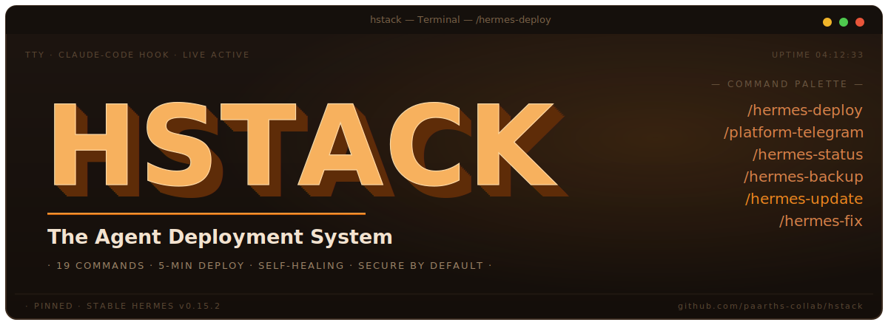
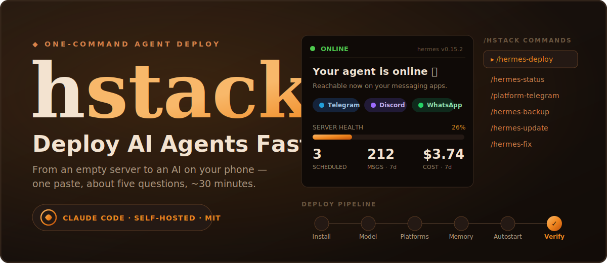

<p align="center">
  
</p>

<h1 align="center">hstack</h1>

<p align="center">
  <strong>One command. Your own self-hosted AI agent, deployed.</strong><br>
  hstack turns <a href="https://claude.com/claude-code">Claude Code</a> into the engineer who installs, wires, and hardens a <a href="https://github.com/NousResearch/hermes-agent">Hermes Agent</a> for you — so a non-developer goes from an empty server to an AI on their phone with a single paste.
</p>

<p align="center">
  <a href="LICENSE"></a>
  
  
  
  
  
  
</p>

<p align="center">
  <a href="#-quick-start">Quick start</a> ·
  <a href="#-commands">Commands</a> ·
  <a href="#-reliability--what-hstack-pre-solves">Reliability</a> ·
  <a href="#-deploy-targets">Deploy targets</a> ·
  <a href="blog/deploy-ai-agent-one-command-hstack.md">Blog</a> ·
  <a href="reference/TROUBLESHOOTING.md">Troubleshooting</a>
</p>

<p align="center">
  
</p>

<p align="center"><em>Modeled on <a href="https://github.com/garrytan/gstack">gstack</a> · Built by Paarth · In collaboration with <a href="https://www.digitalcrew.tech/en">Digital Crew Technology</a></em></p>

---

> **TL;DR** — Paste one command into Claude Code. It installs Hermes Agent, configures the model, wires
> your messaging apps, hardens the deploy, and starts it. You answer ~5 questions (a token, a key, the
> first "hello"). ~30 minutes, empty VPS → AI on your phone.

## Table of contents

- [Why hstack exists](#why-hstack-exists)
- [What you get](#what-you-get)
- [🚀 Quick start](#-quick-start)
- [🧩 Commands](#-commands)
- [⚙️ How it works](#️-how-it-works)
- [🛡️ Reliability — what hstack pre-solves](#-reliability--what-hstack-pre-solves)
- [🌍 Deploy targets](#-deploy-targets)
- [🔑 SSH hand-off (VPS deploys)](#-ssh-hand-off-vps-deploys)
- [🔐 Security defaults](#-security-defaults)
- [🧩 Agent plugins](#-agent-plugins)
- [📝 Blog & guides](#-blog--guides)
- [🤝 Contributing](#-contributing)
- [License](#license)

## Why hstack exists

Installing Hermes was never the hard part — it ships its own `curl | bash`. **The pain is everything after**: long-running gateways that need babysitting, sizable fixed token overhead on every request, auxiliary capabilities that quietly stop when an aux slot is overridden without its key, and allowlists that lock you out.

hstack is **the production layer Hermes is missing** — a self-healing, secured, observable deploy in one Claude Code command, for people who want self-hosting without living in a terminal.

> It took the author ~4 hours to set up Hermes by hand the first time. Once Claude Code had the VPS access, it did ~90% of the work itself. hstack productizes that.

## What you get

- **`/hermes-deploy`** — the whole setup end-to-end: install → model → platforms → skills → memory → personality → home channel → autostart → verify.
- **A library of small commands** for everything after — restart, status, update, fix, and backup.
- **Reliability baked in** — every known trap pre-solved (PATH breakage, the OOM leak, the stale gateway lock, the OAuth-vs-API-key fork, the WhatsApp LID bug). hstack pins a known-good Hermes version.
- **Secure by default** — localhost-bound, allowlist-enforced, secrets `chmod 600`, no open bots.

---

## 🚀 Quick start

> **Requirements:** [Claude Code](https://claude.com/claude-code), Git, and a server to deploy to (a fresh Ubuntu 24.04 VPS works — Hostinger one-click is the easiest; DigitalOcean / Hetzner / any VPS also supported).

### The one command

Open [Claude Code](https://claude.com/claude-code) and paste this **single command**:

```
Install hstack: run
  git clone --depth 1 https://github.com/paarths-collab/hstack.git ~/.claude/skills/hstack
  && cd ~/.claude/skills/hstack && ./setup
Then add an "hstack" section to CLAUDE.md listing the commands, and run /hermes-deploy.
```

That's the whole install. Claude registers the toolkit, then `/hermes-deploy` runs the entire setup
end-to-end — install → model → platforms → skills → memory → personality → home channel → autostart →
verify. It stops only for the ~5 things a machine can't do.

> **Windows:** install under WSL2 — Hermes has no native Windows support.

### What you'll need — and how to get each

You don't need to prepare any of this in advance. **During `/hermes-deploy`, Claude pauses at each step
and tells you exactly where to click and what to copy.** This table is just a reference for what it'll ask.

| You provide | Where to get it (Claude walks you through it) | Needed for |
|-------------|-----------------------------------------------|------------|
| **Server access** | **Hostinger:** hPanel → Docker Manager → Compose → one-click deploy → search "Hermes". **Other VPS:** your SSH host, user, and password/key. | Install |
| **Model API key** | **OpenRouter (easiest):** [openrouter.ai](https://openrouter.ai) → Keys → Create Key → copy `sk-or-...`. **Or OpenAI:** [platform.openai.com/api-keys](https://platform.openai.com/api-keys). | Model |
| **Telegram bot token** | In Telegram, message **@BotFather** → `/newbot` → name it → username ends in `bot` → copy the token. | Telegram |
| **Your Telegram user ID** | In Telegram, message **@userinfobot** → it replies with your numeric ID. | Telegram allowlist |
| **Discord bot token + intents** | [discord.com/developers](https://discord.com/developers/applications) → New Application → Bot → Reset Token. Enable **Message Content** + **Server Members** intents. Invite via the OAuth2 URL. | Discord |
| **Your phone (WhatsApp)** | Scan the QR Claude shows: WhatsApp → Settings → Linked Devices → Link a Device. Allowlist = your number, country code, no `+`. | WhatsApp |
| **Slack tokens** | [api.slack.com/apps](https://api.slack.com/apps) → create app → enable Socket Mode → copy the Bot token (`xoxb-`) and App token (`xapp-`). | Slack |
| **Google AI key** *(optional)* | Free at [aistudio.google.com/apikey](https://aistudio.google.com/apikey) — only for image/audio features. | Extras |

Claude never asks you to paste secrets into the chat carelessly — it writes each one to `~/.hermes/.env`
via `hermes config set` (and `chmod 600`s it), so your keys stay out of logs and history.

---

## 🧩 Commands

### Orchestrator
| Command | Does |
|---------|------|
| `/hermes-deploy` | Full end-to-end deploy. The one most people run. |

### Setup
| Command | Does |
|---------|------|
| `/hermes-install` | Installs Hermes (local or over SSH), pinned + PATH-safe. |
| `/hermes-model` | Configures provider + model + key. Frontier-default, never local. |
| `/hermes-skills` | Installs a curated starter skill pack. |
| `/hermes-memory` | Built-in (default) or an external provider. |
| `/hermes-soul` | Gives the agent a name + personality (`SOUL.md`). |
| `/hermes-home` | Sets the home channel for cron + notifications. |
| `/hermes-cron` | Adds scheduled tasks in plain language. |

### Platforms
| Command | Does |
|---------|------|
| `/platform-telegram` | Telegram bot (the reliable headless wedge). |
| `/platform-discord` | Discord bot (intents + channel config). |
| `/platform-whatsapp` | WhatsApp via QR pairing. |
| `/platform-slack` | Slack (Socket Mode). |
| `/platform-mattermost` | Mattermost (self-hosted). |

### Operations
| Command | Does |
|---------|------|
| `/hermes-status` | Health check — gateway, platforms, memory, logs. |
| `/hermes-restart` | Clean restart (stop → clear locks → start). |
| `/hermes-update` | Safe update with backup + re-verify. |
| `/hermes-fix` | Diagnose + repair common failures. |
| `/hermes-backup` | Back up config + sessions. |

---

## ⚙️ How it works

hstack is a set of Markdown **skills** — instructions Claude Code follows, plus small bash scripts. No new infrastructure, no daemon. Each command is one `skills/<name>/SKILL.md`.

```
You paste one command
        │
        ▼
  ./setup registers the skills + adds an hstack section to CLAUDE.md
        │
        ▼
  /hermes-deploy  ──orchestrates──►  /hermes-install → /hermes-model → platforms →
                                     skills → memory → soul → home → autostart → verify
        │
        └── stops only for secrets/human steps (token, key, QR, OAuth, first hello)
```

### What Claude does vs. what needs you

**Claude does, unattended:** runs the installer, writes every config/secret via `hermes config set`, installs skills, seeds memory + SOUL, creates cron jobs, registers + starts the gateway, runs the smoke test, self-diagnoses.

**Only you can:** mint secrets (bot token, API key, GitHub token), OAuth/device flows, scan the WhatsApp QR, toggle Discord intents, and send the first "hello."

---

## 🛡️ Reliability — what hstack pre-solves

Every item below is a real, logged failure mode hstack handles so you don't hit it:

- **PATH "command not found"** after a "successful" install → PATH-safe absolute paths + explicit reload.
- **Gateway memory leak → OOM crash** ([#25315](https://github.com/NousResearch/hermes-agent/issues/25315)) → pinned version, memory cap, nightly restart, stale-PID clearing.
- **Fixed per-request overhead → surprise bills** (tool definitions + system prompt on every call; community reports the fixed share running well over half in some configurations) → prompt caching, lean SOUL.md, platform-aware tool loading.
- **Auxiliary-capability gaps** (an aux slot overridden without its key — vision/web/compression silently stop) → capability-aware wiring + warnings; aux defaults left on `auto` to reuse the main model.
- **A provider 429 takes the whole gateway offline** ([#16677](https://github.com/NousResearch/hermes-agent/issues/16677)) → context-window validation, fallback.
- **Bounded memory budget** (built-in memory is structured note-taking against a finite budget — practitioners report turns spent consolidating once it fills) → budget surfaced, with one-click external memory.

See [`reference/TROUBLESHOOTING.md`](reference/TROUBLESHOOTING.md) for the full catalogue.

---

## 🌍 Deploy targets

hstack works on **any VPS**, with **Hostinger as the recommended one-click default** (genuinely the easiest path for non-technical users). Provider guides:

| Provider | Path | Difficulty |
|----------|------|-----------|
| **Hostinger** ⭐ | One-click Docker deploy — no terminal | Easiest |
| **DigitalOcean** | Ubuntu Droplet + SSH | Medium |
| **Hetzner / any VPS** | Ubuntu box + SSH (~€4/mo) | Medium |

Full walkthroughs in the [beginner setup guide](blog/01-hermes-setup-guide.md).

## 🔑 SSH hand-off (VPS deploys)

The fastest way to let Claude Code drive a remote deploy is to give it SSH access — once the key
is on the box, it runs every install/config/fix command directly with no copy-pasting.

### Getting connected

**Step 1 — confirm SSH works from your machine first:**
```bash
ssh root@<your-vps-hostname>    # e.g. ssh root@srv1531840.hstgr.cloud
```
If it connects → share the hostname + key path (or a throwaway password). Claude Code's Bash
tool will SSH in and drive everything from there.

**Step 2 — set up key-based auth (required — the Bash tool can't type passwords interactively):**
```bash
# Generate a keypair
ssh-keygen -t ed25519 -f ~/.ssh/hermes_vps -N "" -C "claude-code-hermes-deploy"

# Authorize it on the VPS — always use printf, never echo >>
printf '\n%s\n' "$(cat ~/.ssh/hermes_vps.pub)" >> ~/.ssh/authorized_keys
chmod 600 ~/.ssh/authorized_keys

# First connect — auto-trust the host key
ssh -i ~/.ssh/hermes_vps -o StrictHostKeyChecking=accept-new root@<hostname>
```

**Step 3 — run remote commands via the Bash tool:**
```bash
ssh -i ~/.ssh/hermes_vps root@<hostname> 'bash -s' <<'REMOTE'
# everything here runs on the VPS
hermes --version
REMOTE
```

### Common SSH failures (real failure chain, in order)

| Symptom | Cause | Fix |
|---------|-------|-----|
| `Host key verification failed` | First connect; key not in `known_hosts` | Add `-o StrictHostKeyChecking=accept-new` |
| `Permission denied (publickey,password)` | No key installed; Bash tool can't type a password | Generate keypair, add public key to VPS |
| Key added but `Permission denied` persists | Key added **inside a Docker container**, not on the host — SSH ignores it | Run `whoami; hostname` first. Hex string = container. `exit`, then re-add on the host. |
| Still `Permission denied` after adding on host | Two keys mashed onto one line by `echo >>` — SSH ignores merged lines | Use `printf '\n%s\n'` not `echo >>`. Fix: `sed -i 's/\(digitalcrew\)\(ssh-ed25519\)/\1\n\2/' ~/.ssh/authorized_keys` |
| Works from Windows but not from Bash tool | WSL2 network isolation | Use `-o StrictHostKeyChecking=accept-new -i ~/.ssh/hermes_vps` in the Bash tool; test with `curl -s https://example.com` |

**Check for merged keys:**
```bash
grep -c "^ssh-" ~/.ssh/authorized_keys   # should equal number of keys added
```

**After deploy — rotate the throwaway password:**
```bash
passwd root          # set a strong one
# or lock root login entirely:
sudo passwd -l root
```

See [`reference/TROUBLESHOOTING.md`](reference/TROUBLESHOOTING.md) for the full SSH + install failure catalogue.

## 🔐 Security defaults

- Localhost binding everywhere; network exposure is an explicit, warned opt-in.
- Allowlists enforced (no open bots); secrets written to `.env` with `chmod 600`, never to `config.yaml` or chat.

## 🧩 Agent Plugins

Specialist agents from [Digital Crew Technology](https://www.digitalcrew.tech/en) that plug into your Hermes deployment via the [`hermes-mcp-add`](skills/hermes-mcp-add/SKILL.md) skill.

| Agent | Status | Details |
|---|---|---|
| **Max** — Outbound Sales Force | ✅ Available | [agents/max.md](agents/max.md) |
| **Sophie** — HR Business Partner | 🔜 Coming soon | — |
| **Claire** — Market Mastermind | 🔜 Coming soon | — |
| **Camille** — Customer Support Champion | 🔜 Coming soon | — |
| **Kate** — Marketing Maestro | 🔜 Coming soon | — |
| **André** — Finance & Admin | 🔜 Coming soon | — |

## Honest positioning

Hermes is genuinely good at: **persistent cross-project memory**, an **unmatched messaging-gateway breadth**, "it just runs," and **$6–10/mo cost predictability**. It is *not* "an agent that grows with you / self-improving" — memory is structured note-taking against a tight character budget. hstack describes things as they are.

## 📝 Blog & guides

- [Deploy Your Own AI Agent in One Command with hstack](blog/deploy-ai-agent-one-command-hstack.md) — the one-command guide
- [Set up Hermes Agent — the complete beginner's guide](blog/01-hermes-setup-guide.md) — the manual way, with provider walkthroughs

## 🤝 Contributing

hstack's moat is its accumulated knowledge of what breaks. **Found a new Hermes failure mode and fix?**
That's the most valuable contribution you can make.

1. Fork the repo and create a branch.
2. Add or update a `skills/<name>/SKILL.md`, or add an entry to [`reference/TROUBLESHOOTING.md`](reference/TROUBLESHOOTING.md) (symptom → cause → fix, with the GitHub issue # if there is one).
3. Keep skills tight: frontmatter, the exact commands, the verification, and the pitfall it pre-solves.
4. Open a PR. Every catalogued failure makes the next person's deploy more reliable.

New platform, host, or memory provider? Add a skill — no architecture change needed.

## License

[MIT](LICENSE) — free to use, fork, and modify. Built by **Paarth**. In collaboration with **[Digital Crew Technology](https://www.digitalcrew.tech/en)**.

<p align="center"><sub>hstack is independent open-source software. Hermes Agent is a project of Nous Research. Not affiliated with or endorsed by Nous Research or Hostinger.</sub></p>
