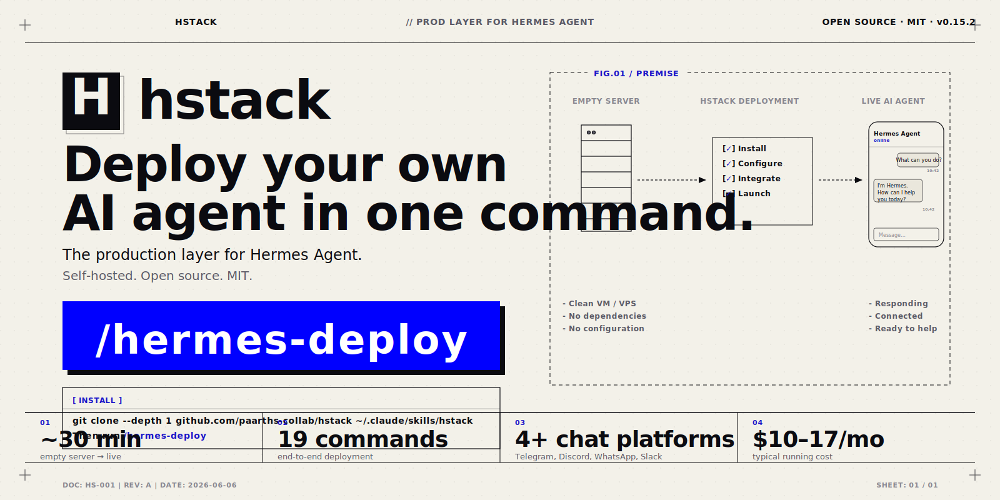

<p align="center">
  
</p>

<h1 align="center">hstack</h1>

<p align="center">
  <strong>One command. Your own self-hosted AI agent, deployed. Works from every major AI coding agent.</strong><br>
  hstack turns your AI coding agent — <a href="https://claude.com/claude-code">Claude Code</a>,
  <a href="https://github.com/openai/codex">Codex</a>,
  <a href="https://cursor.com">Cursor</a>,
  <a href="https://github.com/google/gemini-cli">Gemini CLI</a>,
  <a href="https://docs.openclaw.ai">OpenClaw</a>, or
  <a href="https://github.com/NousResearch/hermes-agent">Hermes itself</a> — into the engineer who installs, wires, and hardens a Hermes Agent for you, then connects <strong>68 external services</strong> on request.
</p>

<p align="center">
  <a href="https://github.com/paarths-collab/hstack"></a>
</p>

<p align="center"><em>If hstack is saving you time, a ⭐ on <a href="https://github.com/paarths-collab/hstack">paarths-collab/hstack</a> goes a long way — it helps others find it.</em></p>

<p align="center">
  <a href="LICENSE"></a>
  
  
  
  
  
  
</p>

<p align="center">
  <a href="#-quick-start">Quick start</a> ·
  <a href="#-what-you-get">What you get</a> ·
  <a href="#-commands">Commands</a> ·
  <a href="#-integrations">Integrations</a> ·
  <a href="#-reliability--what-hstack-pre-solves">Reliability</a> ·
  <a href="#-deploy-targets">Deploy targets</a> ·
  <a href="reference/TROUBLESHOOTING.md">Troubleshooting</a>
</p>

<p align="center"><em>Modeled on <a href="https://github.com/garrytan/gstack">gstack</a> · Built by Paarth · In collaboration with <a href="https://www.digitalcrew.tech/en?utm_source=github&utm_medium=repo&utm_campaign=hstack">Digital Crew Technology</a></em></p>

---

> **TL;DR** — Run one install command. It wires 73 skills into every AI coding agent you have installed
> (Claude Code, Codex, Cursor, Gemini CLI, OpenClaw, and Hermes itself). Then run `/hermes-deploy` from
> any of them. Answer ~5 questions. ~30 minutes later, empty VPS → your own Hermes AI on Telegram /
> WhatsApp / Signal / Slack / Discord / Teams, with any of 68 external services (Notion, Stripe, GitHub,
> Postgres, Pinecone, ElevenLabs, DALL-E, R2, and 60 more) available on demand.

## Table of contents

- [Why hstack exists](#why-hstack-exists)
- [🎯 What you get](#-what-you-get)
- [🚀 Quick start](#-quick-start)
- [🧩 Commands](#-commands)
- [🔌 Integrations](#-integrations)
- [⚙️ How it works](#️-how-it-works)
- [🛡️ Reliability — what hstack pre-solves](#-reliability--what-hstack-pre-solves)
- [🌍 Deploy targets](#-deploy-targets)
- [🔐 Security defaults](#-security-defaults)
- [🧩 Agent plugins](#-agent-plugins)
- [📝 Blog & guides](#-blog--guides)
- [🤝 Contributing](#-contributing)
- [License](#license)

## Why hstack exists

Installing Hermes was never the hard part — it ships its own `curl | bash`. **The pain is everything after**: long-running gateways that need babysitting, sizable fixed token overhead on every request, auxiliary capabilities that quietly stop when an aux slot is overridden without its key, and allowlists that lock you out. And *then* the pain gets worse — you want the agent to actually *do* things, so you spend a week reverse-engineering OAuth flows and MCP endpoints for every service you want it to touch.

hstack is **the production layer Hermes is missing plus the integration cookbook AI agents are missing**. It's a self-healing, secured, observable deploy PLUS 68 hardened service connectors (Notion, Stripe, Postgres, mem0, ElevenLabs, DALL-E, R2, and 62 more), invokable from any AI coding agent you already use.

> It took the author ~4 hours to set up Hermes by hand the first time. Once an AI coding agent had SSH access to the VPS, it did ~90% of the work itself. hstack productizes that, then adds the 68 things you'd want the agent to do next.

## 🎯 What you get

- **`/hermes-deploy`** — the whole setup end-to-end: install → model → platforms → skills → memory → personality → home channel → autostart → verify.
- **73 hardened skills**, agent-agnostic — SSH-first, idempotent, dry-run previews, auto-rollback, lint-clean bash. Written once, run from any of 6 AI coding agents.
- **68 external service integrations** in 12 tiers — memory (mem0, Supermemory), database (Postgres, Supabase, Neon, Redis), vector DB (Pinecone, Qdrant), auth (Auth0, Clerk), observability (Sentry, PostHog), RAG (Firecrawl), code sandbox (E2B), AI tools (DALL-E, Whisper, ElevenLabs, Replicate), storage (R2), plus 50 business SaaS (Notion, Stripe, GitHub, HubSpot, and 46 more).
- **8 messaging platforms** — Telegram, Discord, WhatsApp, Slack, Mattermost, Signal, Google Chat, Teams.
- **6 AI coding agents supported** — Claude Code, Codex, Cursor, Gemini CLI, Hermes itself, OpenClaw. One install wires them all.
- **Reliability baked in** — every known trap pre-solved (PATH breakage, the OOM leak, the stale gateway lock, the OAuth-vs-API-key fork, the WhatsApp LID bug). hstack pins a known-good Hermes version.
- **Secure by default** — localhost-bound, allowlist-enforced, secrets `chmod 600`, no open bots.

---

## 🚀 Quick start

> **Requirements:** at least one AI coding agent installed (Claude Code / Codex / Cursor / Gemini CLI / Hermes / OpenClaw), Git, and a Linux/macOS terminal (Windows: Git Bash, WSL, or `install.ps1`).

### The one command — installs skills into every AI agent on your machine

**Bash / Zsh (macOS / Linux / Git Bash on Windows):**

```bash
curl -fsSL https://raw.githubusercontent.com/paarths-collab/hstack/main/install.sh | bash
```

**PowerShell (Windows):**

```powershell
iwr -useb https://raw.githubusercontent.com/paarths-collab/hstack/main/install.ps1 | iex
```

The installer:

1. **Auto-detects** which AI agents you have (`~/.claude/`, `~/.cursor/`, `~/.hermes/`, `~/.agents/`, `~/.openclaw/`, `~/.gemini/`).
2. **Wires the same 73 skills** into each detected agent, in the right skill-format for each (`.md` for Claude / Codex / Hermes / OpenClaw, `.mdc` for Cursor, `@-referenceable context` for Gemini CLI).
3. **Non-destructive** — never writes secrets, never touches `config.yaml`, safe to re-run.

### Want fewer integrations? Use the picker

Run the installer with `--pick` and it prompts you for which tiers (memory, database, ai-tools, etc.) or specific integrations you want. Everything else is left out.

```bash
curl -fsSL https://raw.githubusercontent.com/paarths-collab/hstack/main/install.sh -o hstack-install.sh
bash hstack-install.sh --pick
```

**Non-interactive alternatives:**

```bash
# only memory + database tiers
curl -fsSL .../install.sh | bash -s -- --tier=memory,database

# only specific integrations by name
curl -fsSL .../install.sh | bash -s -- --include=notion,stripe,mem0,supabase

# only wire to specific IDEs (rather than all detected)
curl -fsSL .../install.sh | bash -s -- --ide=claude,openclaw

# all 68 integrations, non-interactive
curl -fsSL .../install.sh | bash -s -- --all
```

Full flag list: `bash install.sh --help`.

### Then deploy Hermes

Open any AI agent you installed to (Claude Code / Codex / Cursor / etc.) and run:

```
/hermes-deploy
```

`/hermes-deploy` runs the whole setup end-to-end: install → model → platforms → skills → memory →
personality → home channel → autostart → verify. It stops only for the ~5 things a machine can't do
(bot tokens, a QR scan for WhatsApp, the first "hello").

### What you'll need — and how to get each

You don't need to prepare any of this in advance. **During `/hermes-deploy`, the agent pauses at each step
and tells you exactly where to click and what to copy.** This table is just a reference for what it'll ask.

| You provide | Where to get it (the agent walks you through it) | Needed for |
|-------------|--------------------------------------------------|------------|
| **Server access** | **Hostinger:** hPanel → Docker Manager → Compose → one-click deploy → search "Hermes". **Other VPS:** your SSH host, user, and password/key. | Install |
| **Model API key** | **OpenRouter (easiest):** [openrouter.ai](https://openrouter.ai) → Keys → Create Key → copy `sk-or-...`. **Or OpenAI:** [platform.openai.com/api-keys](https://platform.openai.com/api-keys). | Model |
| **Telegram bot token** | In Telegram, message **@BotFather** → `/newbot` → name it → username ends in `bot` → copy the token. | Telegram |
| **Your Telegram user ID** | In Telegram, message **@userinfobot** → it replies with your numeric ID. | Telegram allowlist |
| **Discord bot token + intents** | [discord.com/developers](https://discord.com/developers/applications) → New Application → Bot → Reset Token. Enable **Message Content** + **Server Members** intents. Invite via the OAuth2 URL. | Discord |
| **Your phone (WhatsApp)** | Scan the QR the agent shows: WhatsApp → Settings → Linked Devices → Link a Device. Allowlist = your number, country code, no `+`. | WhatsApp |
| **Slack tokens** | [api.slack.com/apps](https://api.slack.com/apps) → create app → enable Socket Mode → copy the Bot token (`xoxb-`) and App token (`xapp-`). | Slack |
| **Google AI key** *(optional)* | Free at [aistudio.google.com/apikey](https://aistudio.google.com/apikey) — only for image/audio features. | Extras |

The agent never asks you to paste secrets into chat carelessly — it writes each one to `~/.hermes/.env`
via `hermes config set` (and `chmod 600`s it), so your keys stay out of logs and history.

### Wire an integration after deploy

Any of these, invoked in your AI agent after `/hermes-deploy` succeeds:

```
/integration-notion
/integration-stripe
/integration-mem0
/integration-postgres
/integration-firecrawl
/integration-elevenlabs
```

...or `/hermes-integrate` to wire many at once via an interactive picker.

Each integration skill:
- Asks only for the API key + a handful of scope options.
- SSHes into your VPS and writes the key with `chmod 600`, registers the MCP or REST shim, reloads the gateway, runs a live smoke test.
- Rolls back cleanly on any failure.

---

## 🧩 Commands

### Orchestrator
| Command | Does |
|---------|------|
| `/hermes-deploy` | Full end-to-end deploy. The one most people run. |
| `/hermes-integrate` | Wire many integrations at once via an interactive picker. |
| `/hermes-mcp-add` | The generic MCP-wiring primitive (the pattern every /integration-* skill uses). |

### Setup
| Command | Does |
|---------|------|
| `/hermes-install` | Installs Hermes (local or over SSH), pinned + PATH-safe. |
| `/hermes-model` | Configures provider + main + aux models + key. Native support for OpenRouter, OpenAI, Anthropic, Google, Groq, Together, Mistral, Cohere, and more. |
| `/hermes-skills` | Installs a curated starter skill pack. |
| `/hermes-memory` | Built-in (default) or an external provider. |
| `/hermes-soul` | Gives the agent a name + personality (`SOUL.md`). |
| `/hermes-home` | Sets the home channel for cron + notifications. |
| `/hermes-cron` | Adds scheduled tasks in plain language. |

### Platforms (8)
| Command | Does |
|---------|------|
| `/platform-telegram` | Telegram bot (the reliable headless wedge). |
| `/platform-discord` | Discord bot (intents + channel config). |
| `/platform-whatsapp` | WhatsApp via QR pairing. |
| `/platform-slack` | Slack (Socket Mode). |
| `/platform-mattermost` | Mattermost (self-hosted). |
| `/platform-signal` | Signal via signal-cli HTTP daemon. |
| `/platform-google-chat` | Google Chat via Cloud Pub/Sub. |
| `/platform-teams` | Microsoft Teams via Azure AD app + public webhook. |

### Operations
| Command | Does |
|---------|------|
| `/hermes-status` | Health check — gateway, platforms, memory, logs. |
| `/hermes-restart` | Clean restart (stop → clear locks → start). |
| `/hermes-update` | Safe update with backup + re-verify. |
| `/hermes-fix` | Diagnose + repair common failures. |
| `/hermes-backup` | Back up config + sessions. |

---

## 🔌 Integrations

**68 external services** organized into 12 tiers. Every skill is SSH-first, idempotent, dry-run-previewable, and rollback-safe. Every skill was verified against official docs in 2026-06.

### AI-agent-native (built for what agents actually need)

| Tier | Skills | What it enables |
|---|---|---|
| **Memory** | [`/integration-mem0`](skills/integration-mem0/SKILL.md) · [`/integration-supermemory`](skills/integration-supermemory/SKILL.md) | Persistent memory scoped by user/agent/session — no more forgetful bots |
| **Vector DB** | [`/integration-pinecone`](skills/integration-pinecone/SKILL.md) · [`/integration-qdrant`](skills/integration-qdrant/SKILL.md) | RAG storage, semantic search, embeddings-based retrieval |
| **RAG feeder** | [`/integration-firecrawl`](skills/integration-firecrawl/SKILL.md) | LLM-ready markdown from any URL — feed straight into memory |
| **Code sandbox** | [`/integration-e2b`](skills/integration-e2b/SKILL.md) | Safe isolated Python/JS execution (one container per call) |
| **AI tools** | [`/integration-openai-tools`](skills/integration-openai-tools/SKILL.md) · [`/integration-elevenlabs`](skills/integration-elevenlabs/SKILL.md) · [`/integration-replicate`](skills/integration-replicate/SKILL.md) | Non-chat OpenAI (DALL-E, Whisper, embeddings, Batch), voice generation, 10k+ ML models by SHA |

### Infra + auth + observability

| Tier | Skills |
|---|---|
| **Database** | [`/integration-supabase`](skills/integration-supabase/SKILL.md) · [`/integration-postgres`](skills/integration-postgres/SKILL.md) · [`/integration-neon`](skills/integration-neon/SKILL.md) · [`/integration-redis`](skills/integration-redis/SKILL.md) |
| **Auth** | [`/integration-auth0`](skills/integration-auth0/SKILL.md) · [`/integration-clerk`](skills/integration-clerk/SKILL.md) |
| **Observability** | [`/integration-posthog`](skills/integration-posthog/SKILL.md) · [`/integration-sentry`](skills/integration-sentry/SKILL.md) |
| **Storage** | [`/integration-r2`](skills/integration-r2/SKILL.md) *(Cloudflare R2, zero egress)* |
| **Cloud infra** | `/integration-aws` · `/integration-gcp` · `/integration-azure` · `/integration-digitalocean` · `/integration-hetzner` · `/integration-cloudflare` · `/integration-vercel` · `/integration-netlify` · `/integration-railway` · `/integration-render` |

### Business SaaS

| Tier | Skills |
|---|---|
| **CRM** | `/integration-hubspot` · `/integration-salesforce` · `/integration-pipedrive` · `/integration-zoho-crm` |
| **Docs & Notes** | `/integration-notion` · `/integration-google-workspace` · `/integration-microsoft-365` |
| **Dev** | `/integration-github` · `/integration-gitlab` · `/integration-bitbucket` |
| **Project mgmt** | `/integration-jira` · `/integration-linear` · `/integration-asana` · `/integration-clickup` · `/integration-monday` · `/integration-trello` · `/integration-airtable` |
| **Payments** | `/integration-stripe` · `/integration-paypal` · `/integration-razorpay` |
| **Commerce** | `/integration-shopify` · `/integration-woocommerce` · `/integration-webflow` · `/integration-wordpress` |
| **Email & marketing** | `/integration-mailchimp` · `/integration-brevo` · `/integration-sendgrid` · `/integration-postmark` |
| **Comms & support** | `/integration-twilio` · `/integration-sendbird` · `/integration-intercom` · `/integration-zendesk` · `/integration-freshdesk` |
| **Forms & scheduling** | `/integration-typeform` · `/integration-tally` · `/integration-calendly` · `/integration-zoom` |
| **Web search** | `/integration-brave-search` · `/integration-tavily` · `/integration-exa` |

> To wire many integrations at once, use `/hermes-integrate` — interactive picker, then it runs each `/integration-*` skill in series so gateway reloads don't interleave.

### What every integration skill guarantees

- **SSH-first.** The agent SSHes into your VPS as root; runs everything remotely.
- **Idempotent.** Re-running is safe. Set `FORCE=1` to rewire an already-wired integration.
- **Dry-run previewed.** You see exactly what will happen before any write. `AUTO_APPROVE=1` skips the confirm.
- **Live-verified.** Every skill probes the vendor's API with the supplied credentials **before** touching Hermes config — a bad key aborts cleanly, no half-written state.
- **Rollback-safe.** Every skill defines a `rollback()` function that runs automatically on any failure — env vars removed, MCP unregistered, gateway restored.
- **Secrets stay on the VPS.** Written to `~/.hermes/.env` with `chmod 600`, referenced from `config.yaml` by env-var indirection, never printed in chat or logs.

---

## ⚙️ How it works

hstack is a set of Markdown **skills** — instructions AI coding agents follow, plus small bash blocks. No new infrastructure, no daemon. Each command is one `skills/<name>/SKILL.md`.

```
You run one install command
        │
        ▼
  install.sh detects your AI agents + wires the same 73 skills into each
        │
        ▼
  In any AI agent, run:  /hermes-deploy
        │
        ▼
  /hermes-deploy  ──orchestrates──►  /hermes-install → /hermes-model → platforms →
                                     skills → memory → soul → home → autostart → verify
        │
        ├── stops only for secrets/human steps (token, key, QR, OAuth, first hello)
        │
        ▼
  After deploy, invoke any /integration-<name> to wire a service
        │
        ▼
  Each /integration-*:  SSHes to VPS  →  probes vendor API  →  writes secret (chmod 600)
                        →  registers MCP or REST shim  →  reloads gateway  →  smoke tests
                        →  rolls back on failure
```

### What the agent does vs. what needs you

**The agent does, unattended:** runs the installer, writes every config/secret via `hermes config set`, installs skills, seeds memory + SOUL, creates cron jobs, registers + starts the gateway, runs the smoke test, self-diagnoses, wires integrations from your commands.

**Only you can:** mint secrets (bot tokens, API keys, GitHub tokens), OAuth/device flows, scan the WhatsApp QR, toggle Discord intents, and send the first "hello."

---

## 🛡️ Reliability — what hstack pre-solves

Every item below is a real, logged failure mode hstack handles so you don't hit it:

- **PATH "command not found"** after a "successful" install → PATH-safe absolute paths + explicit reload.
- **Gateway memory leak → OOM crash** ([#25315](https://github.com/NousResearch/hermes-agent/issues/25315)) → pinned version, memory cap, nightly restart, stale-PID clearing.
- **Fixed per-request overhead → surprise bills** (tool definitions + system prompt on every call; community reports the fixed share running well over half in some configurations) → prompt caching, lean SOUL.md, platform-aware tool loading.
- **Auxiliary-capability gaps** (an aux slot overridden without its key — vision/web/compression silently stop) → capability-aware wiring + warnings; aux defaults left on `auto` to reuse the main model.
- **A provider 429 takes the whole gateway offline** ([#16677](https://github.com/NousResearch/hermes-agent/issues/16677)) → context-window validation, fallback.
- **Stale PID after crash → systemd restart loop** ([#13655](https://github.com/NousResearch/hermes-agent/issues/13655)) → PID validity check + auto-clear at restart.
- **No built-in backup** ([#12238](https://github.com/NousResearch/hermes-agent/issues/12238)) → `/hermes-backup` catches this.
- **Bounded memory budget** (built-in memory is structured note-taking against a finite budget) → budget surfaced, with one-click external memory via `/integration-mem0` or `/integration-supermemory`.
- **Silent integration failure modes** — every `/integration-*` skill's Pitfalls table encodes the vendor-specific mistakes (Zendesk's `/token` email suffix, Sendbird's `Api-Token` header vs Bearer, Notion's OAuth-only hosted MCP, R2's `region=auto` requirement, etc.).

See [`reference/TROUBLESHOOTING.md`](reference/TROUBLESHOOTING.md) for the full catalogue.

---

## 🌍 Deploy targets

hstack works on **any VPS**, with **Hostinger as the recommended one-click default** (genuinely the easiest path for non-technical users). Provider guides:

| Provider | Path |
|----------|------|
| **Hostinger** | One-click Docker deploy — no terminal |
| **DigitalOcean** | Ubuntu Droplet + SSH |
| **Hetzner / any VPS** | Ubuntu box + SSH (~€4/mo) |
| **AWS EC2 / GCP Compute** | Full walkthroughs via `/integration-aws` and `/integration-gcp` |

Full walkthroughs in the [beginner setup guide](blog/01-hermes-setup-guide.md).

## 🔐 Security defaults

- Localhost binding everywhere; network exposure is an explicit, warned opt-in.
- Allowlists enforced (no open bots); secrets written to `~/.hermes/.env` with `chmod 600`, never to `config.yaml` or chat.
- Every hard-gate integration skill (WhatsApp, Slack, Signal, Teams, Google Chat) refuses to enable itself with an empty allowlist — the operator gets a clear abort message instead of a silent open-to-the-world bot.
- SSH-first pattern: every action is a reviewable command executed on the user's VPS, not a hidden background daemon.
- Live token verification against the vendor's API happens **before** anything is written locally — a bad token aborts cleanly.

## 🧩 Agent Plugins

Specialist agents from [Digital Crew Technology](https://www.digitalcrew.tech/en?utm_source=github&utm_medium=repo&utm_campaign=hstack) that plug into your Hermes deployment via the [`hermes-mcp-add`](skills/hermes-mcp-add/SKILL.md) skill.

| Agent | Status | Details |
|---|---|---|
| **Max** — Outbound Sales Force | ✅ Available | [agents/max.md](agents/max.md) |
| **Sophie** — HR Business Partner | 🔜 Coming soon | — |
| **Claire** — Market Mastermind | 🔜 Coming soon | — |
| **Camille** — Customer Support Champion | 🔜 Coming soon | — |
| **Kate** — Marketing Maestro | 🔜 Coming soon | — |
| **André** — Finance & Admin | 🔜 Coming soon | — |

## Honest positioning

Hermes is genuinely good at: **persistent cross-project memory**, an **unmatched messaging-gateway breadth**, "it just runs," and **$6–10/mo cost predictability**. It is *not* "an agent that grows with you / self-improving" — built-in memory is structured note-taking against a tight character budget. When you want deeper memory, `/integration-mem0` or `/integration-supermemory` wires the real thing.

hstack describes things as they are. Every "honest auth picture" section in every integration skill was verified against official vendor docs before it shipped.

## 📝 Blog & guides

- [Deploy Your Own AI Agent in One Command with hstack](blog/deploy-ai-agent-one-command-hstack.md) — the one-command guide
- [Set up Hermes Agent — the complete beginner's guide](blog/01-hermes-setup-guide.md) — the manual way, with provider walkthroughs

## 🤝 Contributing

hstack's moat is its accumulated knowledge of what breaks and what integrations actually work. **Found a new Hermes failure mode and fix, or verified a new integration?** That's the most valuable contribution you can make.

1. Fork the repo and create a branch.
2. Add or update a `skills/<name>/SKILL.md`, or add an entry to [`reference/TROUBLESHOOTING.md`](reference/TROUBLESHOOTING.md) (symptom → cause → fix, with the GitHub issue # if there is one).
3. New integrations follow the hardening template at [`templates/SKILL.template.md`](templates/SKILL.template.md) — SSH-first, idempotent, dry-run, rollback, honest auth picture. Every bash block must pass `bash scripts/lint-md-bash.sh`.
4. Open a PR. Every catalogued failure or new integration makes the next person's deploy more capable.

New platform, host, memory provider, or AI-tools vendor? Add a skill — no architecture change needed.

## License

[MIT](LICENSE) — free to use, fork, and modify. Built by **Paarth**. In collaboration with **[Digital Crew Technology](https://www.digitalcrew.tech/en?utm_source=github&utm_medium=repo&utm_campaign=hstack)**.

<p align="center"><sub>hstack is independent open-source software. Hermes Agent is a project of Nous Research. Not affiliated with or endorsed by Nous Research, Hostinger, or any of the 68 integrated services.</sub></p>
